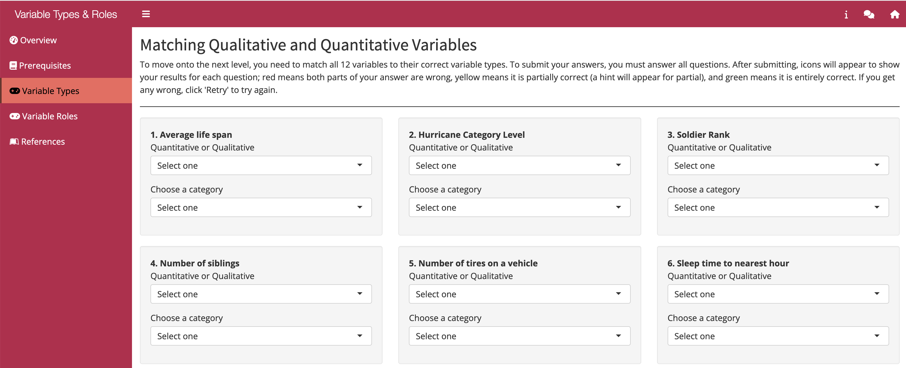

# Variable Types Matching Game

 

# App Description
Identify variable types by nature of measurement (quantitative (numeric) discrete, quantitative continuous, qualitative (categorical) nominal, and qualitative ordinal variables) and by role in the analysis (explanatory, response, and confounding).
